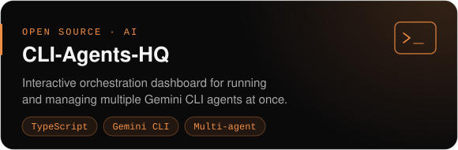
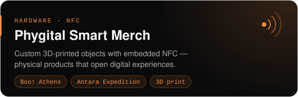

  

  <b>Designing digital experiences &amp; building the physical objects that carry them.</b>

  
  
  
  

## 🧪 About the lab

- 🛠️ **What I build** — full-stack web apps and 3D-designed hardware, often in the same project.
- 🤖 **Exploring** — AI orchestration: running fleets of CLI agents to automate the complex so the creative part stays human.
- ⚡ **How I work** — rapid prototyping. Idea on Monday, printed and tappable by Friday.
- 💬 **Ask me about** — Next.js, Fusion 360, 3D printing, NFC merch, multi-agent workflows.
- 📍 Based in **Greece**.

## 🔭 Featured work

  
  

## ⚙️ From idea to object

  

## 🧰 Toolbox

**Code** 

**Make** 

**AI** 

## 📡 Signals

  
  

  

---

  Built in the lab · Greece 🇬🇷 · <a href="https://damianslab.gr">damianslab.gr</a>

